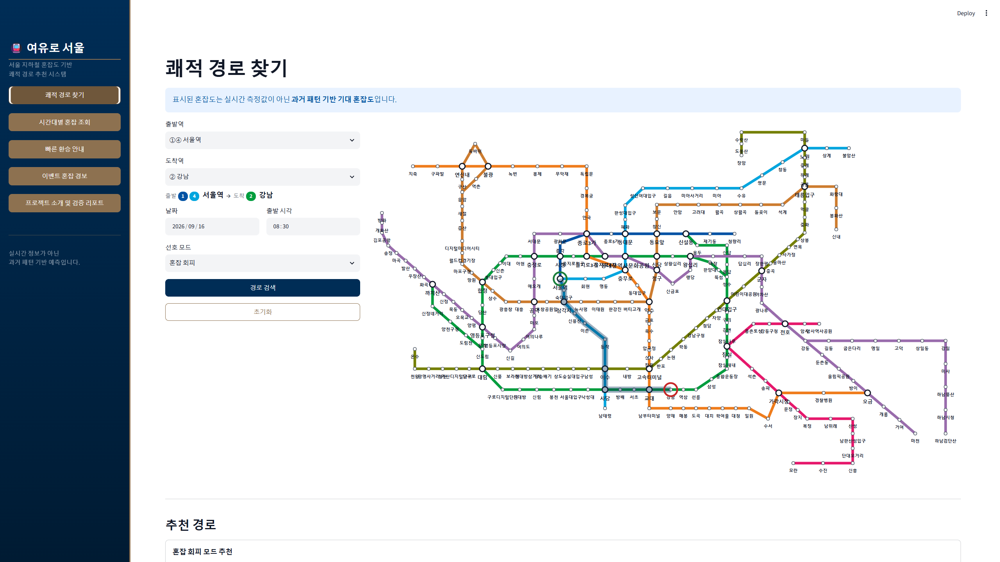
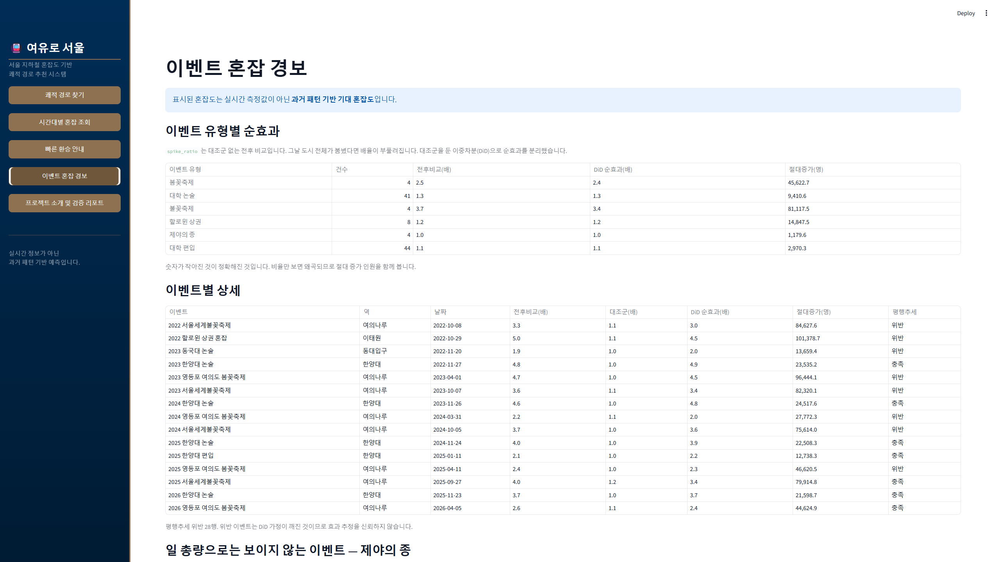
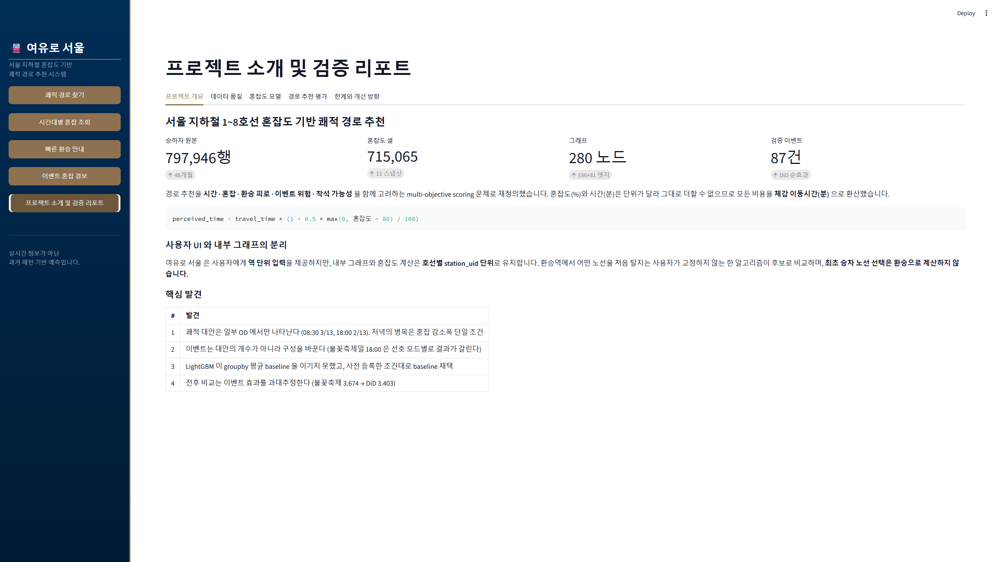
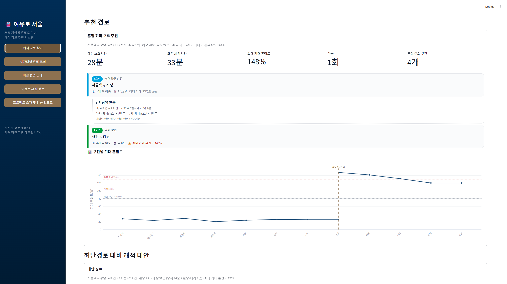
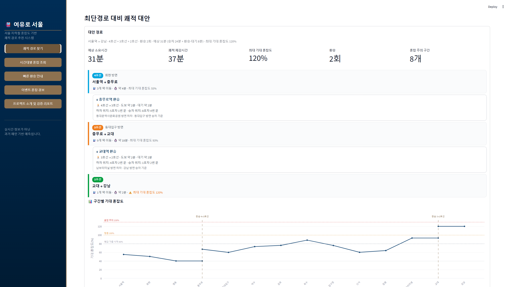
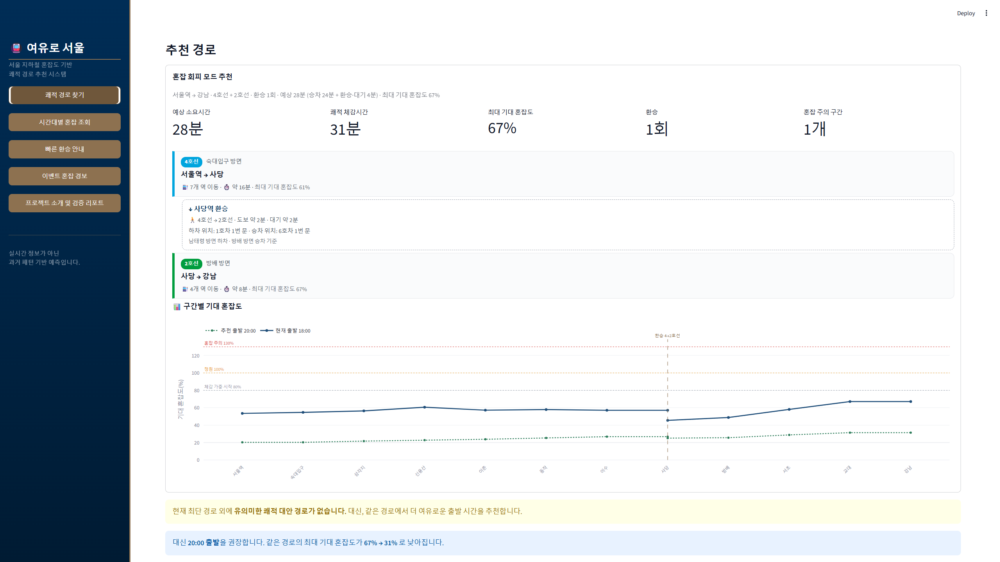
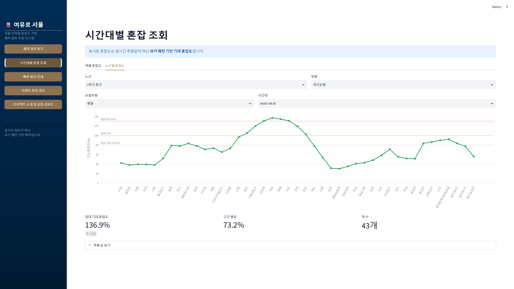

# 여유로 서울 (Yeoyuro Seoul)

> 최단시간을 넘어, 최적의 쾌적함을 제안합니다.

**[🚇 Live Demo](https://yeoyuro-seoul.streamlit.app/)**

> 표시되는 혼잡도는 실시간 측정값이 아니라 **과거 패턴 기반 기대 혼잡도**입니다.
> 환승 대기시간은 30분 단위 평균 배차 기반 추정이며, 최초 승차 전 대기시간은 포함하지 않습니다.
> 무료 호스팅 특성상 접속이 없으면 앱이 대기 상태로 전환되어, 첫 접속 시 기동에 20~30초가 걸릴 수 있습니다.

서울 지하철 1~8호선 혼잡도 기반 쾌적 경로 추천 시스템입니다.
과거 승하차·혼잡도·환승·이벤트 데이터를 결합해 기대 혼잡도, 환승 피로도,
이벤트 위험, 평균 환승 대기시간을 함께 고려합니다.

**Yeoyuro Seoul** is a congestion-aware, multi-objective subway routing system.
Built on Streamlit, it estimates expected congestion from historical Seoul Metro
data and recommends comfort-optimized alternative routes.


[](https://github.com/FlightChamp/yeoyuro-seoul/actions/workflows/tests.yml)



<sub>클릭형 벡터 노선도(5120×2880)에서 출발·도착역을 고르면 추천 경로가 지도 위에 표시됩니다.</sub>

---

## 1. 문제 정의

기존 길찾기는 최단시간·최소환승 중심입니다. 실제 이용자는 다른 요구를 갖습니다.

- 5~10분 더 걸려도 덜 붐비는 경로를 타고 싶다
- 환승이 힘든 역은 피하고 싶다
- 행사 때문에 특정 역이 폭발적으로 붐비는 날을 피하고 싶다

여유로 서울은 경로 추천을 최단경로 문제가 아니라
**시간 · 혼잡 · 환승 피로 · 이벤트 위험 · 착석 가능성**을 함께 고려하는
multi-objective scoring 문제로 재정의합니다.

혼잡도(%)와 시간(분)은 단위가 달라 그대로 더할 수 없습니다.
모든 비용을 **체감 이동시간(분)** 으로 환산했습니다.

```
perceived_time = travel_time × (1 + 0.5 × max(0, 혼잡도 − 80) / 100)
edge_cost      = perceived_time + transfer_penalty + event_risk
```

---

## 2. 핵심 결과

| # | 발견 | 근거 |
|---|---|---|
| 1 | **쾌적 대안은 일부 OD 에서만 나타나고, 저녁의 병목은 혼잡 감소폭이다** | 08:30 **3/13** · 18:00 **2/13**. 저녁에 걸러내는 조건은 `cong_drop` 28건 단일 |
| 2 | **이벤트는 대안의 개수가 아니라 구성을 바꾼다** | 불꽃축제일 18:00 은 선호 모드별로 결과가 갈린다(calm 2/13, 그 외 3/13) |
| 3 | **LightGBM이 groupby 평균 baseline을 이기지 못했다** | Skill Score **−0.464**, 사전 등록한 조건대로 baseline 채택 |
| 4 | **전후 비교는 이벤트 효과를 과대추정한다** | 불꽃축제 3.674배 → DiD 순효과 **3.403배** |

3번이 이 프로젝트에서 가장 중요한 결과입니다. 자세한 판단 근거는
[`docs/model_card_congestion.md`](docs/model_card_congestion.md)에 있습니다.



<sub>전후 비교(`spike_ratio`)와 대조군을 둔 이중차분(DiD) 순효과를 나란히 둡니다.
불꽃축제 3.7배 → 3.4배처럼 **숫자가 작아진 것이 정확해진 것**입니다.
평행추세를 위반한 이벤트는 DiD 가정이 깨진 것이므로 효과 추정을 신뢰하지 않습니다.</sub>

---

## 3. 데이터

서울교통공사·서울열린데이터광장 공공데이터 **74개 파일**입니다.

| 데이터 | 파일 | 규모 |
|---|---|---|
| 역별 시간대별 이용인원 | 48 | 원본 797,946행 → mart 15,957,680행 |
| 지하철혼잡도정보 | 11 | long 715,299행 (스키마 3종 드리프트) |
| 환승역 환승인원 | 9 | 각 73행 |
| 수도권 환승 상세(호차/문) | 1 | 892행 중 범위 내 375행 |
| 역간거리·소요시간 | 3 | 279행 (서울교통공사 2 · 국가철도공단 1) |
| 열차운행현황 | 1 | 호선별 영업거리·소요시간·표정속도. 정차시간 교차검증에 사용 |
| 1~8호선 역별 일별 승객유형별 수송인원 | 1 | 576,714행. 보조 검증용 |

원본은 재배포 제약으로 저장소에 포함하지 않습니다. 재현 방법은
[`docs/DATA.md`](docs/DATA.md)를 참고하세요.

### 데이터가 없어서 못 하는 것

이 선언이 프로젝트의 신뢰도를 만듭니다.

| 못 하는 것 | 사유 | 대신 제공 |
|---|---|---|
| 실시간 혼잡도 예측 | 실시간 위치·재차 데이터 없음 | 과거 패턴 기반 **기대 혼잡도** |
| 객차별 혼잡도 예측 | 객차 단위 재차 데이터 없음 | 환승 동선상 유리한 호차/문 |
| 착석 확률 | 좌석 점유 데이터 없음 | 착석 가능성 **proxy 점수** |
| 이벤트 당일 실제 혼잡도 | 혼잡도가 분기 평균 패턴 | 이벤트성 spike 기반 **위험 보정** |

---

## 4. 파이프라인

```
raw ─▶ staging ─▶ master ─▶ marts ─┬─▶ [Model A] 이벤트 spike + DiD
                                    ├─▶ [Model B] 기대 혼잡도
                                    └─▶ route graph (280 노드 / 536+81 엣지)
                                              ▼
                                   route scoring ─▶ Streamlit 서비스
```

| 스크립트 | 역할 | 핵심 산출물 |
|---|---|---|
| `bootstrap_yeoyuro_seoul.py` | 폴더·마스터 8종 생성 | `data/master/*` |
| `01_build_ridership_mart.py` | 승하차 48개월 통합 | station_master 283행 |
| `03_build_stg_congestion.py` | 혼잡도 11스냅샷 통합 | 스키마 3종 자동 대응 |
| `04_build_congestion_mart.py` | 라벨·split·프로파일 | 715,065 셀 |
| `05_build_event_spike_mart.py` | 이벤트 spike 검증 | 87건 |
| `05b_did_event_effect.py` | 이중차분 순효과 | 대조군 248역 |
| `06_build_route_graph.py` | 그래프 구축 | 강연결 True |
| `06b_smoke_test_graph.py` | 그래프 구조 검증 | 9/9 PASS |
| `07_build_training_mart.py` | 학습 마트 | 706,678행 |
| `08_train_congestion_model.py` | 모델 학습·판정 | baseline 채택 |
| `08b_evaluate_congestion_model.py` | 표준 지표 평가 | ladder·PR-AUC·SHAP |
| `09_route_scoring_prototype.py` | 경로 스코어링 | 체감시간 환산 |
| `10_evaluate_routes.py` | 3축 Pareto 평가 | Stretch·Jaccard |
| `11_validate_schemas.py` | pandera 스키마 검증 | PASS 17 |
| `12_build_display_masters.py` | 역 단위 사용자 마스터 | 240역 |
| `14_import_map_workbook.py` | 노선도 좌표 임포트 | 5120×2880 |
| `15_build_headway_mart.py` | 30분 평균 배차간격 임포트 | 환승 대기시간용 |

---

## 4-1. 그래프 모델링에서 실제로 겪은 것

공개 데이터를 그대로 그래프로 만들면 **존재하지 않는 경로**가 추천됩니다.

| 문제 | 대응 |
|---|---|
| 분기역을 한 노드로 두면 지선 승객이 갈아타지 않고 통과 | 성수·신도림·강동을 본선/지선 노드로 분리 |
| **6호선 응암순환**에서 `구산 → 응암 → 역촌`이 환승 없이 이어짐 | 순환 종료 노드(`응암@eungam_loop`)를 분리하고 재승차 환승 엣지 추가 |
| 노드 분리 후 `구산 → 응암 → 새절 → 응암 → 역촌` **U턴**이 재승차를 우회 | 역 재방문 금지 제약 추가 |
| 환승 호차/문이 진행 방향과 무관하게 선택됨 | 경로의 앞뒤 역으로 방면을 좁혀 선택 |

U턴은 **배차가 긴 낮 시간대에만** 나타나 08:30 검증에서는 잡히지 않았습니다.
그래서 regression test를 5개 시간대로 돌립니다(경로 탐색 regression 41건).

검증 규모는 계층적으로 나뉩니다.

| 계층 | 대상 | 결과 |
|---|---|---|
| 전체 pytest | `tests/` 5개 파일 | **116 passed** |
| ├ 경로 탐색 regression | `test_station_routing.py` | 41 |
| ├ 중간역 정차시간 | `test_dwell_time.py` | 18 |
| ├ 환승 방면 표기 | `test_transfer_direction.py` | 27 |
| ├ 표시값 정합성 | `test_timeline_consistency.py` | 13 |
| └ 직결 분기 통과 | `test_through_junction.py` | 17 |
| 그래프 구조 | `06b_smoke_test_graph.py` | 9/9 PASS |
| 스키마·교차검증 | `11_validate_schemas.py` | PASS 17 |

## 5. 평가 체계

각 단계의 **문제 유형을 식별하고 그에 맞는 표준 지표**를 붙였습니다.

| 레이어 | 문제 유형 | 채택 지표 |
|---|---|---|
| 데이터 품질 | 스키마 검증 | pandera + 교차검증 |
| 이벤트 효과 | **인과 효과 추정** | DiD, 평행추세 검증, absolute_lift |
| 혼잡도 예측 | 회귀 + **불균형 분류** | Baseline ladder, Skill Score, PR-AUC, Ablation, SHAP |
| 경로 추천 | **다목적 최적화** | 3축 Pareto, Stretch Factor, directed-edge Jaccard |
| 착석 가능성 | **검증 불가** | 정답 데이터 없음 — 한계로 명시 |

마지막 행이 이 표를 진짜로 만듭니다. 검증할 수 없는 것을 검증한 척하지 않았습니다.



<sub>학습 **전에** 정한 통과 조건을 앱 안에 그대로 띄웁니다.
baseline ladder 에서 L1→L2 로 MAE 가 11.1 → 2.4 로 떨어지고,
ablation 의 B→C 에서 승하차 흐름 피처가 R² 를 0.450 → 0.734 로 올립니다.</sub>

전체 근거는 [`docs/evaluation_strategy.md`](docs/evaluation_strategy.md)에 있습니다.

### 도입하지 않은 것과 이유

| 후보 | 판단 이유 |
|---|---|
| LSTM / Transformer / GNN | 혼잡도 스냅샷이 **11개**뿐. 격자당 관측치 11개에 딥러닝은 과적합만 남는다 |
| NDCG / MAP | 랭킹 지표는 정답 선호도 라벨이 필요한데 사용자 피드백이 없다 |
| MASE | 시계열 naive forecast 를 분모로 쓰는 지표라 격자 회귀에 정의가 맞지 않는다 → Skill Score |
| MLflow | 학습이 사실상 1회. 도구를 위한 도구가 된다 |

---

## 6. 데모

```bash
streamlit run app/streamlit/yeoyuro_seoul_app.py -- --root .
```

| 화면 | 내용 |
|---|---|
| 쾌적 경로 찾기 | 클릭형 벡터 노선도(5120×2880), 노선형 타임라인 카드 |
| 시간대별 혼잡 조회 | 역별 / 노선별 기대 혼잡도 단면 |
| 빠른 환승 안내 | 환승 동선상 유리한 호차/문 |
| 이벤트 혼잡 경보 | 전후 비교 vs DiD 순효과 |
| 프로젝트 소개 및 검증 리포트 | 데이터 품질·모델·경로 평가·한계 |

### 추천 경로 카드



예상 소요시간·쾌적 체감시간·최대 기대 혼잡도·환승·혼잡 주의 구간을 함께 보여주고,
구간마다 **방면(경로상 다음 역 기준)** 과 이동 역 수·소요시간·기대 혼잡도를 분리해 표시합니다.
소요시간은 `승차 + 환승 도보·대기` 로 나누어 어디서 시간이 드는지 드러냅니다.

### 환승 안내 — 방향까지 맞춘다



같은 환승역이라도 **진행 방향에 따라 유리한 위치가 정반대**입니다.
그래서 경로의 앞뒤 역으로 방면을 좁혀 호차/문을 고르고, 어떤 방면 기준인지 함께 밝힙니다.
객차별 혼잡도 데이터가 없으므로 "이 칸이 덜 붐빈다"고 말하지 않습니다.

### 대안이 없으면 만들지 않는다



유의미한 쾌적 대안이 없을 때는 우회 경로를 지어내지 않고
**같은 경로에서 더 여유로운 출발 시간**을 제안합니다.
후보 경로 비교표에서 왜 대안이 탈락했는지 직접 확인할 수 있습니다.

### 노선별 혼잡 단면



노선·방향·요일유형·시간대를 고르면 노선 전체의 기대 혼잡도를 **운행 순서대로** 봅니다.
역 순서는 역번호가 아니라 그래프를 걸어서 만듭니다.
성수지선이 `성수(211) → 용답(244) → 신답(245) → 용두(250) → 신설동(246)` 처럼
번호와 운행 순서가 다르기 때문입니다.

사용자는 **역 단위**로 입력하고, 내부 그래프와 혼잡도 계산은 **호선별 station_uid** 단위를 유지합니다.
환승역에서 어떤 노선을 처음 탈지는 알고리즘이 후보로 비교하며,
**최초 승차 노선 선택은 환승으로 계산하지 않습니다.**

경로 안내에는 노선별 방면(경로상 다음 역 기준), 구간별 이동 역 수·소요시간·기대 혼잡도,
환승 도보시간과 **30분 평균 배차간격 기반 환승 대기시간**, 환승 동선상 유리한 호차/문이
분리되어 표시됩니다.

---

## 7. 재현

```bash
git clone https://github.com/FlightChamp/yeoyuro-seoul.git
cd yeoyuro-seoul
python -m venv .venv && source .venv/bin/activate   # Windows: .venv\Scripts\activate
pip install -r requirements.txt

# 원본 데이터를 data/raw/ 아래에 배치 (docs/DATA.md 참고)
python bootstrap_yeoyuro_seoul.py --root .
python scripts/01_build_ridership_mart.py  --raw data/raw/ridership_monthly --root .
python scripts/03_build_stg_congestion.py  --raw-dir data/raw/congestion_quarterly --out-root .
python scripts/04_build_congestion_mart.py --root .
python scripts/05_build_event_spike_mart.py --root .
python scripts/05b_did_event_effect.py     --root .
python scripts/06_build_route_graph.py     --root .
python scripts/06b_smoke_test_graph.py     --root .
python scripts/07_build_training_mart.py   --root .
python scripts/08_train_congestion_model.py --root .
python scripts/08b_evaluate_congestion_model.py --root .
python scripts/10_evaluate_routes.py       --root . --time 08:30
python scripts/11_validate_schemas.py      --root . --strict
python scripts/12_build_display_masters.py --root .
python scripts/14_import_map_workbook.py   --root . --xlsx data/master/yeoyuro_seoul_vector_map_coordinate_workbook.xlsx
python scripts/15_build_headway_mart.py    --root . --src data/raw/headway

pytest tests/ -v
streamlit run app/streamlit/yeoyuro_seoul_app.py -- --root .
```

`data/raw`, `data/staging`, `data/interim`, 학습용 대용량 mart, `models`는 저장소에 없습니다.
위 순서대로 실행하면 재생성됩니다.

`data/marts` 에는 **배포 앱이 런타임에 읽는 경량 mart 만** 포함돼 있습니다
(`route_edge_mart`, `transfer_edge_mart`, `congestion_edge_lookup`, `congestion_station_profile`,
`transfer_tip_mart`, `event_did_mart`, `event_spike_mart`, `headway_*`, `route_evaluation_*` — 합계 약 0.9MB).
앱 실행만 할 거라면 파이프라인을 돌리지 않아도 됩니다.

---

## 8. 프로젝트 범위

```
1호선 서울역~청량리    2호선 전구간(성수·신정지선 포함)
3호선 지축~오금        4호선 불암산~남태령
5호선 방화~하남검단산 / 방화~마천
6호선 응암~신내        7호선 장암~온수        8호선 암사역사공원~모란
```

9호선·신분당선·공항철도 등 v1 데이터·그래프 구축 범위 밖 노선은 그래프와 환승 집계에서 제외합니다.
강남역은 2호선·신분당선 환승역이지만 신분당선이 범위 밖이라 환승역으로 집계하지 않습니다.

---

## 9. 한계

1. **고혼잡 구간에서 오차가 6배** — ~30% 구간 MAE 1.474 vs 130%+ 구간 9.227.
   그래서 고혼잡 경고는 절대값이 아니라 상대 순위로 제공합니다.
2. **`label_high` 기준 불일치** — 미관측 역은 전역 p95로 대체되어 분류 지표에 편향이 있습니다.
3. **Pareto front는 K개 후보 안에서의 front** — Yen's K-shortest 집합에 한정됩니다.
4. **출발 시각의 time_bin을 경로 전체에 고정** — 시간 전진을 반영하지 않았습니다.
5. **환승 대기시간은 30분 bin 평균** — 특정 시각의 실제 다음 열차가 아니며,
   균등 도착(기댓값 = 배차/2)을 가정합니다. 최초 승차 전 대기는 반영하지 않습니다.
6. **미해결** — 혼잡도 산식(정원 대비 %인지), 스냅샷 날짜의 의미, 8호선 오차 원인.

---

## 10. 문서

| 문서 | 내용 |
|---|---|
| [`docs/PROJECT_PLAN_v2.md`](docs/PROJECT_PLAN_v2.md) | 실측 기반 개정 기획안 |
| [`docs/evaluation_strategy.md`](docs/evaluation_strategy.md) | 평가 체계 전체 |
| [`docs/model_card_congestion.md`](docs/model_card_congestion.md) | 모델 카드 |
| [`docs/DATA.md`](docs/DATA.md) | 데이터 출처·재현·제외 사유 |
| `reports/` | 실행 산출 리포트(데이터 품질·모델·경로 평가) |

---

## 11. 라이선스

코드는 MIT 라이선스입니다. `LICENSE` 참고.

데이터는 서울교통공사·서울열린데이터광장의 공공데이터이며 저장소에 포함하지 않습니다.
각 데이터의 이용 조건은 원 출처를 따릅니다.
