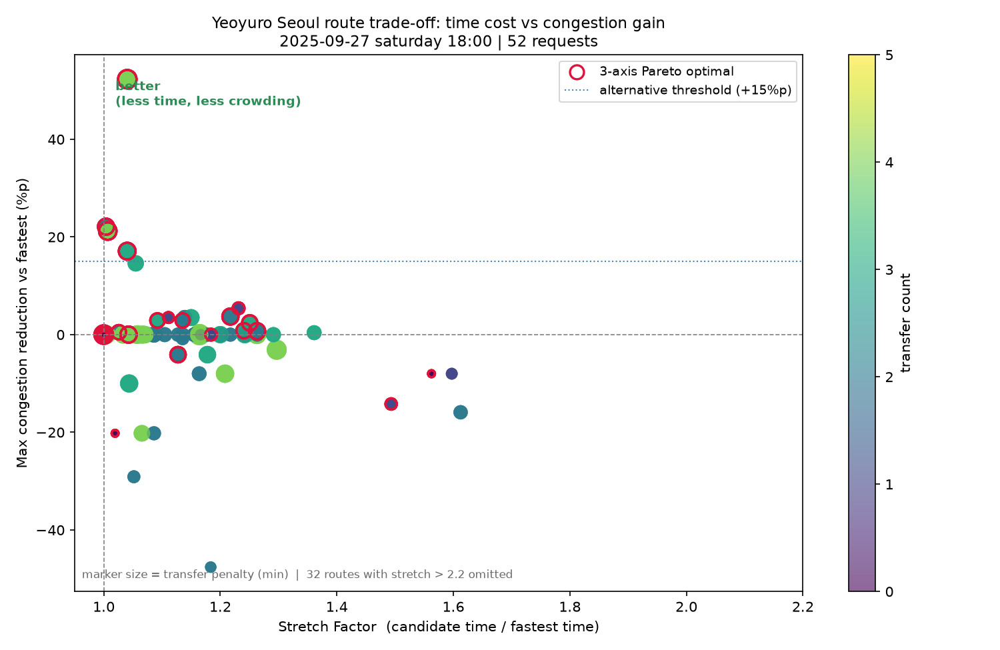

# Route Recommendation Evaluation

## 1. 목적

추천 알고리즘이 최단경로와 다른 의미 있는 대안 경로를 만들어내는지 검증한다.
경로 추천에는 정답 경로가 없으므로 Accuracy 계열 지표를 쓸 수 없다. 다목적 최적화의 표준 도구인 Pareto optimality 와 Stretch Factor 를 쓴다.

## 2. 평가 데이터

- OD쌍 12개 x 선호 모드 4종 = 요청 52건
- 후보 경로: **328**개
- 출발 조건: 2025-09-27 / saturday / 18:00 (time_bin 18:00~18:30)
- 혼잡도 기준: congestion_edge_lookup 의 스냅샷 **중앙값** (예측 모델이 아니라 관측 패턴. 08 판정에 따라 baseline 을 사용한다)
- 그래프: route_edge_mart 536 엣지 / transfer_edge_mart 82 엣지

## 3. 평가 지표

| 지표 | 정의 | 역할 |
|---|---|---|
| 3-axis Pareto | (actual_time, max_congestion, transfer_penalty) 비지배 | 후보 보존·열등 판정 |
| Stretch Factor | candidate_time / fastest_time | OD 간 비교 가능한 시간 손실 |
| Max congestion reduction | fastest_max - candidate_max (%p) | 혼잡 이득 |
| Perceived time gain | fastest_perceived - candidate_perceived (분) | 체감 이득 |
| Directed-edge Jaccard | (from,to,line,direction) 집합 유사도 | 경로 다양성 |
| Meaningful alternative rate | 채택 조건 통과 비율 | 서비스 가치 |

> Pareto 는 **후보 보존 장치**이지 최종 순위가 아니다. 최종 순위는 perceived_time_min 기반 모드별 scoring 으로 정한다.

## 4. 주요 결과

### 4-1. 모드별 요약

| preference_mode   |   요청 |   대안있음 |   평균후보수 |   평균파레토수 |   평균Jaccard_top3 |   near_dup |
|:------------------|-----:|-------:|--------:|---------:|-----------------:|-----------:|
| balanced          |   13 |      3 |   6.308 |    2.462 |            0.301 |         22 |
| calm              |   13 |      2 |   6.308 |    2.462 |            0.298 |         22 |
| fast              |   13 |      3 |   6.308 |    2.462 |            0.325 |         22 |
| min_transfer      |   13 |      3 |   6.308 |    2.462 |            0.334 |         22 |

### 4-2. OD쌍별 결과 (calm 모드)

| OD         |   n_candidate_routes |   n_pareto_routes_3d |   best_max_congestion_reduction |   best_stretch_factor |   avg_jaccard_similarity_top3 | has_meaningful_alternative   |
|:-----------|---------------------:|---------------------:|--------------------------------:|----------------------:|------------------------------:|:-----------------------------|
| 신촌->잠실     |                    7 |                    3 |                             3.7 |              nan      |                        0.6394 | False                        |
| 서울역->강남    |                    6 |                    3 |                             0   |              nan      |                        0.2293 | False                        |
| 군자->여의나루   |                    6 |                    1 |                             0   |              nan      |                        0.403  | False                        |
| 한양대->고속터미널 |                    7 |                    4 |                            22.1 |                1.0039 |                        0.15   | True                         |
| 혜화->사당     |                    6 |                    1 |                             0   |              nan      |                        0.2549 | False                        |
| 종각->이태원    |                    6 |                    2 |                             3.5 |              nan      |                        0.0784 | False                        |
| 건대입구->홍대입구 |                    7 |                    2 |                             0.7 |              nan      |                        0.5916 | False                        |
| 안암->삼성     |                    5 |                    4 |                             2.9 |              nan      |                        0.21   | False                        |
| 방화->마천     |                    8 |                    4 |                            21.2 |                1.0069 |                        0.3202 | True                         |
| 응암->고속터미널  |                    5 |                    2 |                             2.4 |              nan      |                        0.3604 | False                        |
| 신설동->까치산   |                    7 |                    3 |                            52.3 |              nan      |                        0.3809 | False                        |
| 연신내->응암    |                    6 |                    2 |                             0   |              nan      |                        0.1444 | False                        |
| 응암->연신내    |                    6 |                    1 |                             0   |              nan      |                        0.1167 | False                        |

- 유의미한 대안이 나온 OD쌍: **2/13**
  - 한양대->고속터미널, 방화->마천
- 대안이 없는 OD쌍: **11/13**
  - 신촌->잠실, 서울역->강남, 군자->여의나루, 혜화->사당, 종각->이태원, 건대입구->홍대입구, 안암->삼성, 응암->고속터미널, 신설동->까치산, 연신내->응암, 응암->연신내

> front_size = 1 인 OD 는 trade-off 자체가 존재하지 않는다는 뜻이다. 임의 임계값이 아니라 **수학적으로** 대안이 없음을 보인다.

### 4-3. 탈락 사유별 후보 수

| recommendation_policy     |   routes |
|:--------------------------|---------:|
| no_meaningful_alternative |      206 |
| primary                   |       52 |
| rejected                  |       34 |
| near_duplicate            |       25 |
| meaningful_alternative    |       11 |

**혼잡 감소는 있으나 조건 미달로 탈락한 사례 (상위 5)**

| request_id              |   stretch_factor |   time_loss_vs_fastest |   max_congestion_reduction_vs_fastest |   transfer_count |   transfer_penalty_min |
|:------------------------|-----------------:|-----------------------:|--------------------------------------:|-----------------:|-----------------------:|
| 한양대->고속터미널|fast         |           1.0549 |                    1.4 |                                  14.6 |                3 |                   12.6 |
| 한양대->고속터미널|calm         |           1.0549 |                    1.4 |                                  14.6 |                3 |                   12.6 |
| 한양대->고속터미널|min_transfer |           1.0549 |                    1.4 |                                  14.6 |                3 |                   12.6 |
| 한양대->고속터미널|balanced     |           1.0549 |                    1.4 |                                  14.6 |                3 |                   12.6 |
| 한양대->고속터미널|fast         |           1.2314 |                    5.9 |                                   5.4 |                1 |                    5.2 |

**환승 부담이 큰 탈락 사례 (transfer_penalty 상위 5)**

| request_id           |   transfer_count |   transfer_penalty_min | transfer_stations      |   stretch_factor |
|:---------------------|-----------------:|-----------------------:|:-----------------------|-----------------:|
| 서울역->강남|fast         |                4 |                   23.3 | 서울역;이수;고속터미널;교대        |           1.1644 |
| 서울역->강남|calm         |                4 |                   23.3 | 서울역;이수;고속터미널;교대        |           1.1644 |
| 서울역->강남|min_transfer |                4 |                   23.3 | 서울역;이수;고속터미널;교대        |           1.1644 |
| 서울역->강남|balanced     |                4 |                   23.3 | 서울역;이수;고속터미널;교대        |           1.1644 |
| 혜화->사당|fast          |                4 |                   20.2 | 동대문역사문화공원;을지로3가;충무로;사당 |           1.2969 |

### 4-4. 임계 민감도 — 어느 조건이 대안을 막았나

| 조건 | 이 조건만 풀면 대안이 생기는 요청 수 |
|---|---|
| cong_drop | 28 |
| not_near_dup | 4 |

> 임계값(15분 / 15%p / 5분)은 근거 있는 상수가 아니다. 어느 조건이 병목인지 밝혀두면 나중에 사용자 피드백으로 튜닝할 수 있다.

### 4-5. 모드 간 추천 경로가 달라지는가

- 모드에 따라 선택 경로가 달라진 OD쌍: **13/13**
- 달라지지 않은 OD쌍은 해당 구간에 대안 자체가 없다는 뜻이다. 서울 지하철 구조상 직통 노선 하나뿐인 구간이 존재한다.

## 5. 대표 시각화

- x축 Stretch Factor, y축 최대혼잡 감소(%p)
- 색상 transfer_count, 크기 transfer_penalty_min
- 붉은 테두리 = 3축 Pareto optimal
- 좌상단으로 갈수록 좋다(시간 손해 적고 혼잡 이득 큼)

## 6. 그래프 경고

- [warning] 응암순환 정방향 엣지 누락: [('6_구산', '6_응암')]

## 7. 한계

- 실시간 혼잡도가 아니라 **과거 스냅샷 기반 기대 혼잡도**다.
- 객차별 혼잡도가 아니다. 호차/문 안내는 환승 동선 기준이다.
- 착석 확률이 아니라 **착석 가능성 proxy** 점수다.
- 환승 호차/문은 원본 데이터에 있는 조합만 안내한다.
- 출발 시각의 time_bin 을 경로 전체에 고정 적용한다(시간 전진 미반영).
- 대안 채택 임계값(15분 / 15%p / 5분)은 근거 있는 상수가 아니라 **튜닝 대상 초기값**이다.
- 대안이 없는 OD쌍은 억지로 만들지 않고 `no_meaningful_alternative` 를 반환한다.

## 8. 면접용 요약

> 경로 추천은 단순 최단시간 문제가 아니라 시간, 최대 혼잡도, 환승 피로도를 함께 고려하는 다목적 최적화 문제로 정의했습니다. 수학적으로는 실제시간·최대혼잡·환승페널티 3축 Pareto optimality 로 후보 경로의 열등 여부를 판단하고, 포트폴리오 시각화에서는 Stretch Factor 와 최대혼잡 감소폭의 2축 그래프에 환승 부담을 색상과 크기로 인코딩했습니다.

## 9. 처리 노트

- 활성 이벤트 1건: 서울세계불꽃축제 2025(x2.44, 4역, 종일)
- 혼잡도 매칭 536/536 엣지 (100.0%)
- 이벤트 보정 적용 엣지 10개 (추가 체감시간 합 1.9분)

## 10. 산출물

- `route_evaluation_mart` : data\marts\route_evaluation_mart_20250927_1800.parquet
- `route_evaluation_summary` : data\marts\route_evaluation_summary_20250927_1800.parquet
- `route_eval_cases` : reports\route\route_eval_cases_20250927_1800.csv
- `route_eval_summary` : reports\route\route_eval_summary_20250927_1800.csv
- `pareto_front_scatter` : reports\route\pareto_front_scatter_20250927_1800.png